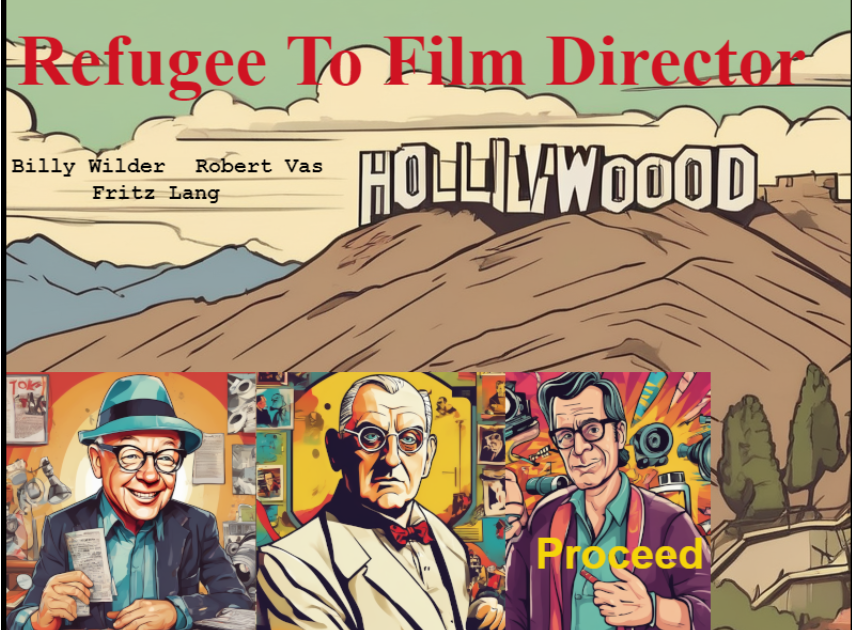
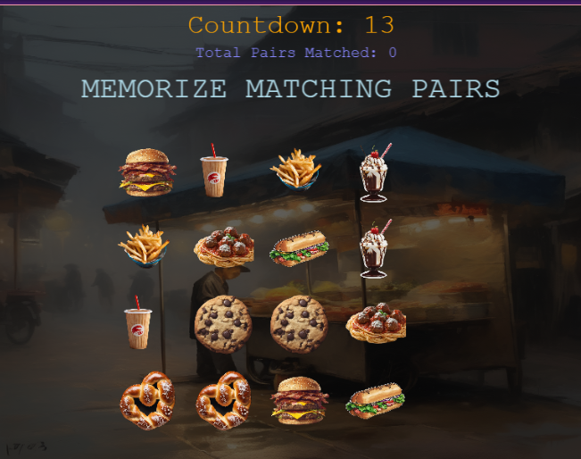

# Refugee To Film Director
A short story/game about 3 refugees who became film directors followed by a short memory card game using the film set as the theme.
Aimed at ages 18-25, the 1-2 minute game offers a quick look into the life of 3 refugee film directors. The game allows the player to memorise historic filmset items and beat the timer.

## Link to deployed page: 
https://vickysug.github.io/refugee-to-film-director/

## Link to my storyborad on Canva: 
https://www.canva.com/design/DAGIaQjznxE/o3CW7Qh_LAxB2zwFyoGqYw/edit?utm_content=DAGIaQjznxE&utm_campaign=designshare&utm_medium=link2&utm_source=sharebutton

## Project Brief

This project was my fourth brief during my internship with BIZGEES. The brief:

* Select a celebrity or group of celebrity refugees.

* Compile the information and background.

* Create a short 30 second - 2 minute game aimed at age group 18 -25.

* The game is to allow the player to learn about the refugee/s.

* Use AI to aid the creation.

I chose 3 film directors; Billy Wilder, Robert Vas and Fritz Lang.

## Technologies used

For the project the aim was to use AI, mainly Rosebud AI (https://play.rosebud.ai/home)

On the platform a developer can clone games created by other developers and change them for their own purpose. 

I chose to use a game Munch 'N' Match, Evolved from: 2D Playground Created by: radio_biscuit. And the original 2D Playground.

Although Rosebud can generate AI images, I created some in Rosebud and altered them in Photoshop where needed. 
Rosebud also allows the AI chat to change code, however. 

If I were to expand the game further, it would include more background music from one of the films.